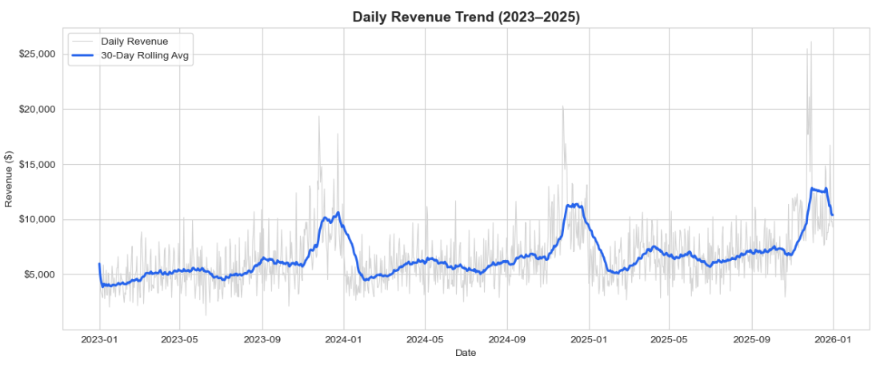
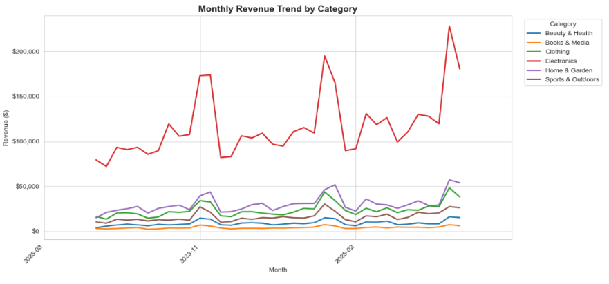

# INTERN ID - CTTS070
# Sales Trend Visualization

A data analytics project exploring revenue trends, seasonality, and performance breakdowns from retail sales data, built in Jupyter Notebook using pandas, matplotlib, and seaborn.
## Dashboard Preview

## Dashboard Preview

### Sales Trend Chart



### Monthly Revenue Trend by Category




## Project Files

| File | Description |
|---|---|
| `Sales_Trend_Visualization.ipynb` | Main analysis notebook with all charts and insights |
| `sales_data.csv` | Synthetic retail sales dataset (2023–2025) |
| `README.md` | This file |

## Dataset

`sales_data.csv` contains 53,519 order-level records spanning **2023–2025**, generated to mimic realistic retail behavior — weekend spikes, Nov–Dec holiday surges, Black Friday peaks, and ~12% built-in year-over-year growth.

| Column | Description |
|---|---|
| `OrderID` | Unique order identifier |
| `Date` | Order date |
| `Category` | Product category (Electronics, Clothing, Home & Garden, Sports & Outdoors, Books & Media, Beauty & Health) |
| `Region` | Sales region (North, South, East, West, Central) |
| `Channel` | Sales channel (Online, In-Store) |
| `UnitsSold` | Number of units in the order |
| `UnitPrice` | Price per unit ($) |
| `Discount` | Discount applied (0–0.25) |
| `Revenue` | Final order revenue ($) |


## What's in the Notebook

1. **Setup & Data Loading** – imports and initial look at the data
2. **Data Cleaning & Feature Engineering** – missing values, duplicates, derived date fields (Year, Month, Quarter, Weekday)
3. **Overall Sales Trend** – daily (with 30-day rolling average), monthly, and yearly revenue
4. **Seasonality Analysis** – revenue by month, by day of week, and a month × year heatmap
5. **Category Performance** – total revenue by category and category trends over time
6. **Regional Performance** – revenue by region (bar + pie chart)
7. **Channel Comparison** – Online vs. In-Store revenue trend
8. **Year-over-Year Growth** – YoY % growth chart
9. **Key Insights Summary** – auto-generated headline stats (top month, category, region, growth rate)

## How to Run

### 1. Install requirements
```bash
pip install pandas numpy matplotlib seaborn jupyter
```

### 2. Launch Jupyter
Make sure `sales_data.csv` is in the same folder as the notebook, then:
```bash
jupyter notebook Sales_Trend_Visualization.ipynb
```

### 3. Run all cells
In Jupyter: **Cell → Run All** (or run cells top to bottom).

## Possible Extensions

- **Forecasting** – predict future sales with Prophet or ARIMA
- **Customer segmentation / cohort analysis** (if customer-level data is added)
- **Interactive dashboard** – rebuild key charts in Plotly Dash or Streamlit
- **Profitability analysis** – add cost data to compute margins, not just revenue

## License / Notes

The dataset is synthetic and intended for learning/demo purposes only — it does not represent any real business.
